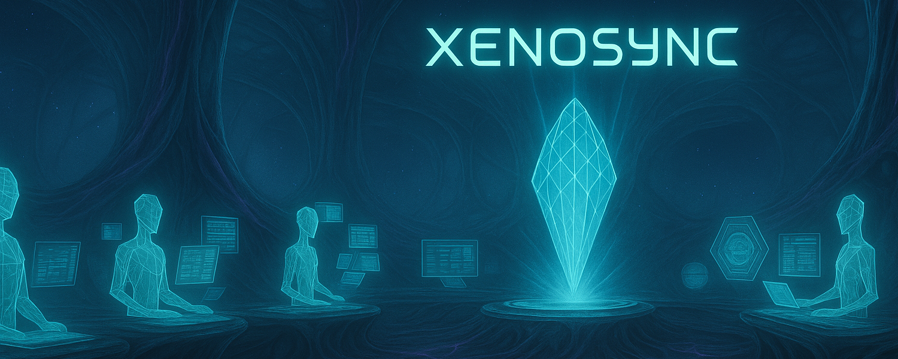

# Xenosync
### Synchronization Platform for Multi-Agent AI Orchestration

<p align="center">
  
</p>

[](https://github.com/xenosync/xenosync)
[](https://python.org)
[](LICENSE)

## What is Xenosync?

Xenosync is an otherworldly orchestration platform that synchronizes multiple AI agents to work in perfect harmony, like an alien hive mind building software.

## Features

- **👽 Alien Hive Mind**: Coordinate up to 20 AI agents simultaneously
- **🌌 Multiple Sync Modes**: Sequential, Parallel, Collaborative, Distributed, and Hybrid execution
- **🔮 Visual Monitoring**: Tmux-based visualization with real-time agent status
- **🧬 Smart Coordination**: SQLite-backed work claims and conflict resolution
- **⚡ Dependency Analysis**: Intelligent task distribution based on dependencies
- **🎭 Strategy Patterns**: Flexible execution strategies for different project types

## Quick Start

### Installation

```bash
# Clone the repository
git clone https://github.com/xenosync/xenosync.git
cd xenosync

# Install Xenosync
pip install -e .

# Initialize Xenosync
xenosync init
```

### Basic Usage

```bash
# Single agent (traditional mode)
xenosync start my_prompt.yaml

# Multi-agent parallel execution
xenosync start my_prompt.yaml --agents 4 --mode parallel

# Collaborative hive mind mode
xenosync start my_prompt.yaml --agents 3 --mode collaborative

# Smart distributed execution
xenosync start my_prompt.yaml --agents 5 --mode distributed
```

### Demo Prompts

Try these ready-to-run demo prompts to see Xenosync in action:

```bash
# Build a retro multiplayer Snake game (25 mins)
xenosync start prompts/demos/retro-game.yaml --agents 4 --mode parallel

# Generate documentation for any codebase (30 mins)
xenosync start prompts/demos/code-documenter.yaml --agents 5 --mode distributed

# Create a personal productivity dashboard (20 mins)
xenosync start prompts/demos/personal-dashboard.yaml --agents 4 --mode parallel

# Build chatbots with unique personalities (25 mins)
xenosync start prompts/demos/chatbot-personality.yaml --agents 3 --mode collaborative
```

Each demo showcases different multi-agent capabilities and produces immediately usable results!

## Execution Modes

### Sequential Mode
Traditional single-agent execution for critical, order-dependent tasks.

### Parallel Mode  
Multiple agents working independently on separate tasks.

### Collaborative Mode
Agents self-organize around all tasks, choosing work based on availability and capabilities.

### Distributed Mode
Intelligent distribution based on task dependencies and agent workload.

### Hybrid Mode
Dynamically switches between modes based on project phase.

## Commands Reference

<details>
<summary><b>Click to expand full command reference</b></summary>

### Core Commands
```bash
# Initialize Xenosync
xenosync init
xsync init                       # Short alias

# Start a sync session
xenosync start                   # Interactive prompt selection
xenosync start my_prompt.yaml    # Use specific prompt
xsync start --agents 4 --mode parallel  # Multi-agent mode

# Execution modes
xenosync start prompt.yaml --mode sequential   # Single agent (default)
xenosync start prompt.yaml --agents 4 --mode parallel      # Independent tasks
xenosync start prompt.yaml --agents 3 --mode collaborative # Self-organizing
xenosync start prompt.yaml --agents 5 --mode distributed   # Dependency-aware
xenosync start prompt.yaml --agents 3 --mode hybrid        # Mixed phases
```

### Monitoring & Management
```bash
# Session management
xenosync status                  # Check current status
xenosync attach <session-id>     # Attach to running session
xenosync list                    # List all sessions
xenosync kill <session-id>       # Kill a running session
xenosync monitor --multi-agent   # Web dashboard

# Prompt management
xenosync prompt list             # List available prompts
xenosync prompt validate <file>  # Validate a prompt file
xenosync prompt convert <in> <out> # Convert between formats
```

### Example Workflows
```bash
# Simple Web App (Parallel)
xsync start webapp.yaml --agents 4 --mode parallel

# Complex System (Collaborative)
xsync start enterprise.yaml --agents 6 --mode collaborative

# Dependency-Heavy Project (Distributed)
xsync start microservices.yaml --agents 8 --mode distributed

# Critical Path (Sequential)
xsync start critical.yaml --mode sequential
```

</details>

## Configuration

Xenosync configuration is stored in `~/.xenosync/config.yaml`:

```yaml
multi_agent:
  enabled: true
  default_agents: 3
  default_mode: collaborative
  
execution_modes:
  parallel: {enabled: true, min_agents: 2, max_agents: 10}
  collaborative: {enabled: true, min_agents: 2, max_agents: 10}
  distributed: {enabled: true, min_agents: 2, max_agents: 20}
```

<details>
<summary><b>Advanced Configuration Options</b></summary>

### Full Configuration Structure
```yaml
# General settings
default_profile: normal
use_tmux: true
auto_continue: true
log_level: INFO

# Paths
prompts_dir: prompts
sessions_dir: xsync-sessions
templates_dir: templates

# Session settings
session_name_prefix: build
max_retries: 3
retry_delay: 60

# Claude settings
claude_command: claude
claude_args: ['--dangerously-skip-permissions']
initial_wait: 3

# TODO detection settings
wait_for_todo: true
todo_wait_timeout: 90
todo_patterns: [todos, todo, task, steps, plan, ready]

# Database
database_path: xenosync.db

# Monitoring
enable_web_monitor: true
monitor_port: 8080
monitor_host: localhost

# Notifications
enable_notifications: false
notification_webhook: null
```

### Sync Profiles
- **Fast**: 5-minute intervals, 4-minute minimum duration
- **Normal**: 10-minute intervals, 8-minute minimum duration  
- **Careful**: 20-minute intervals, 15-minute minimum duration

</details>

## 🏗️ Architecture

<details>
<summary><b>Technical Architecture & Components</b></summary>

### Core Components

- **CLI** (`xenosync/cli.py`) - Main command-line interface using Click
- **Config** (`xenosync/config.py`) - Configuration management with sync profiles
- **XenosyncOrchestrator** (`xenosync/orchestrator.py`) - Async orchestration engine
- **SessionManager** (`xenosync/session_manager.py`) - SQLite-based session tracking
- **AgentManager** (`xenosync/agent_manager.py`) - Multi-agent pool management
- **CoordinationManager** (`xenosync/coordination.py`) - Work claims and conflict resolution
- **ExecutionStrategies** (`xenosync/execution_strategies.py`) - Different sync modes
- **TmuxManager** (`xenosync/tmux_manager.py`) - Visual agent monitoring
- **ClaudeInterface** (`xenosync/claude_interface.py`) - Interface to Claude CLI

### Key Patterns

1. **Async Architecture**: Python's asyncio for concurrent operations
2. **SQLite Storage**: Sessions and coordination in `~/.xenosync/xenosync.db`
3. **YAML Prompts**: Structured format with metadata, steps, and strategies
4. **Sync Profiles**: Fast (5s wait), Normal (30s wait), Careful (60s wait)
5. **Tmux Integration**: Visual monitoring of agent collective
6. **Work Claims**: Prevents conflicts between agents
7. **Inter-Agent Messaging**: Hive mind communication

### Multi-Agent Coordination

#### Agent Pool Management
- Dynamic agent creation and monitoring
- Health checks and automatic recovery
- Load balancing and work distribution
- Performance metrics per agent

#### Coordination System
- SQLite-backed work claims
- File-level conflict detection
- Automatic stale claim cleanup (2-hour expiry)
- Inter-agent messaging
- Completed work logging

#### Visual Monitoring
- Tmux windows: Orchestrator, Agents, Monitor
- Real-time agent status updates
- Pane highlighting (active/idle/error)
- Hive status display

</details>

## 💻 Development

<details>
<summary><b>Development Setup & Commands</b></summary>

### Installation for Development
```bash
# Install with development dependencies
pip install -e ".[dev]"
```

### Development Commands
```bash
# Run tests
pytest

# Format code
black xenosync/

# Type checking
mypy xenosync/

# Linting
flake8 xenosync/
```

### Project Structure
```
xenosync/
├── prompts/              # Prompt templates
│   ├── examples/        # Example prompts
│   └── projects/        # Project-specific prompts
├── xenosync/            # Main package
│   ├── cli.py          # CLI interface
│   ├── config.py       # Configuration
│   ├── orchestrator.py # Core orchestration
│   ├── agent_manager.py # Agent management
│   ├── coordination.py # Work coordination
│   └── ...
└── tests/              # Test suite
```

</details>

## 🔧 Advanced Features

<details>
<summary><b>Advanced Features & Implementation Notes</b></summary>

### Work Claims System
Prevents conflicts between agents working on the same files:
- Agents claim files before editing
- Claims auto-expire after 2 hours
- Conflict detection before work starts
- Automatic cleanup of stale claims

### Inter-Agent Messaging
- Broadcast messages to all agents
- Point-to-point messaging between specific agents
- Message types: work_claim, work_release, status_update, help_request

### Performance Analytics
- Track agent performance metrics
- Optimize task distribution
- Identify bottlenecks
- Generate performance reports

### Automatic Recovery
- Failed agents are detected automatically
- Work is redistributed to healthy agents
- Session state is preserved
- Resumable from interruption points

### Important Implementation Notes
- Always run from the project root directory
- The `--dangerously-skip-permissions` flag is used to avoid interactive prompts
- Session data persists in SQLite database
- Maximum 20 agents per session (hive size limit)
- Both session and coordination data support resuming interrupted sessions

</details>

## 👽 Alien Terminology

<details>
<summary><b>Xenosync Glossary</b></summary>

The platform uses alien-themed terminology:
- **Hive**: Collection of agents
- **Collective**: All agents working together
- **Sync**: Build/execution process
- **Transmission**: Messages between components
- **Cycle**: Time units in alien coordinate system
- **Harmonization**: Agent coordination
- **Synthesis**: Task completion

</details>

## 📖 Documentation

- [Getting Started Guide](docs/getting-started.md)
- [Execution Strategies](docs/strategies.md)
- [API Reference](docs/api.md)
- [Migration Guide](docs/migration.md)

## 🤝 Contributing

We welcome contributions from across the galaxy! Please see [CONTRIBUTING.md](CONTRIBUTING.md) for guidelines.

## 📜 License

MIT License - see [LICENSE](LICENSE) file.

## 🙏 Acknowledgments

- Built on Claude Code AI technology
- Inspired by alien hive mind coordination

---

**Xenosync** - *Where alien intelligence meets perfect synchronization* 👽🚀